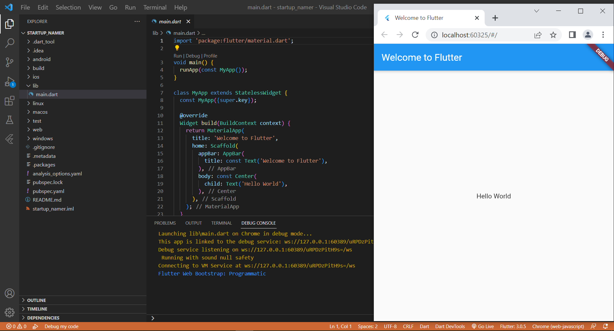
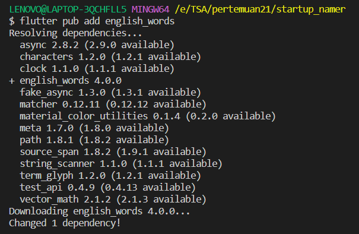
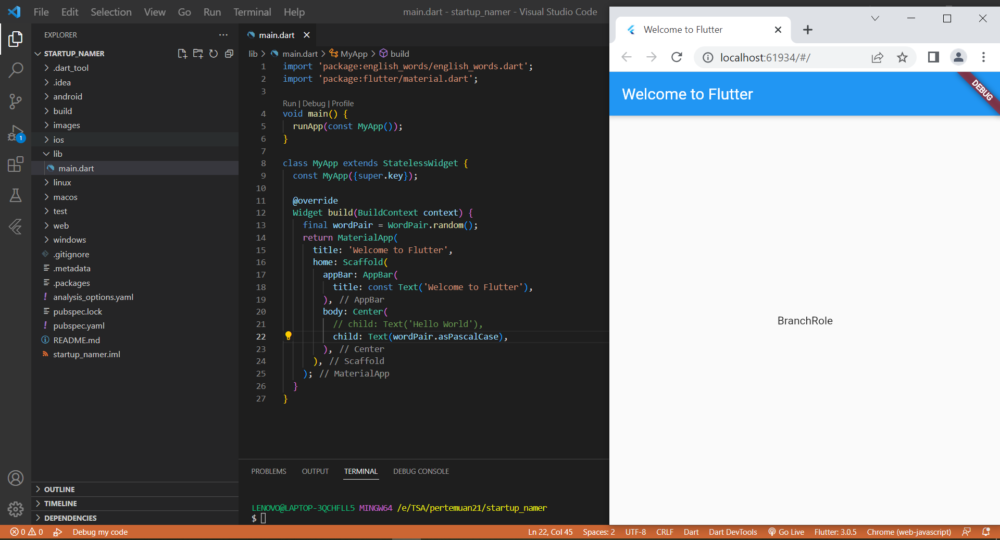
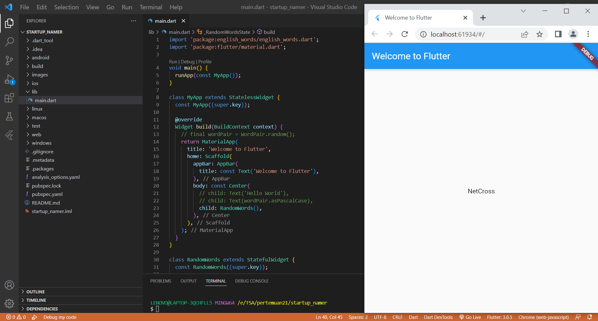
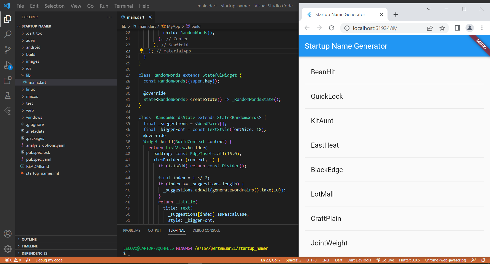

# startup_namer

Tugas Praktikum Pertemuan 21 TSA

## Create the starter Flutter app

## Use an external package

### Step 1:  Add the english_words package

### Step 2: import the new package and change main.dart

## Add a stateful widget

## Create an infinite scrolling ListView

